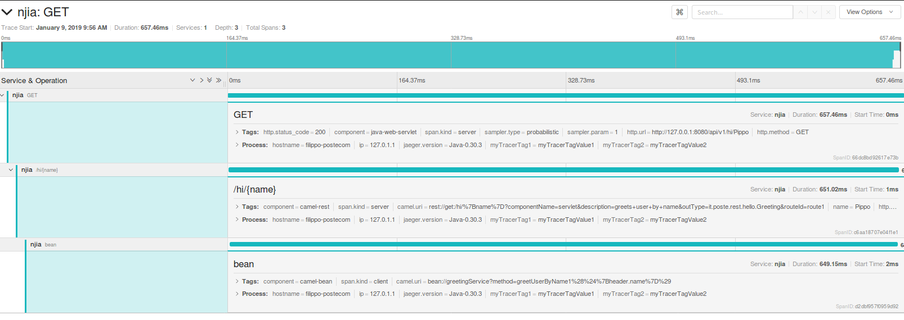

Esempio servizi REST con Apache Camel
===

Start
---

Il servizio può essere lanciato con

```console
$ mvn clean spring-boot:run
```

Gli endpoint possono essere invocati con curl:

```console
$ curl -v -X GET "http://127.0.0.1:8080/api/v1/hello"
$ curl -v -X POST "http://127.0.0.1:8080/api/v1/hello"
$ curl -v -X GET "http://127.0.0.1:8080/api/v1/hi/Pippo"
$ curl -v -X GET "http://127.0.0.1:8080/api/v1/bye/Pluto"
```


Documentazione SWAGGER
---

La documentazione è disponibile alla seguente URL: http://127.0.0.1:8080/api/v1/api-doc


OpenTracing
---

Per abilitare OpenTracing è necessario lanciare Jaeger:


```console
$ docker run -d --name jaeger\
   -e COLLECTOR_ZIPKIN_HTTP_PORT=9411\
   -p 5775:5775/udp\
   -p 6831:6831/udp\
   -p 6832:6832/udp\
   -p 5778:5778\
   -p 16686:16686\
   -p 14268:14268\
   -p 9411:9411\
   jaegertracing/all-in-one:1.8
```

Per la configurazione del client fare riferimento alla seguente documentazione:  https://github.com/opentracing-contrib/java-spring-jaeger

È possibile visualizzare il tracciato delle API nell'esempio alla seguente url:  http://localhost:16686/search


Per esempio, il servizio REST **/hi/{name}** genera i tre seguenti span (servizio, direct client, direct server)





Metriche
---

Le metriche sono disponibili all'endpoint http://127.0.0.1:8080/actuator/prometheus

Al di la delle metriche standard [jvm, tomcat, memoria, logback, ..] sono state abilitate le metriche automatiche delle "route" Camel.
Inoltre nel codice è illustrato come implementare metriche applicative, sia direttamente nelle rotte via DSL che in Bean annotati con @Timed.


Di seguito le metriche applicative implementate:

```console
# TYPE poste_greetUserByName3_timer1_seconds_max gauge
poste_greetUserByName3_timer1_seconds_max{class="it.poste.rest.hello.GreetingService",custom_tag_greetUserByName3_1="custom_tag_greetUserByName3_2",exception="none",method="greetUserByName3",myMetricTag1="myMetricTagValue1",myMetricTag2="myMetricTagValue2",service="camel-rest",} 0.0
# HELP poste_greetUserByName3_timer1_seconds This is a custom timer METRIC
# TYPE poste_greetUserByName3_timer1_seconds summary
poste_greetUserByName3_timer1_seconds_count{class="it.poste.rest.hello.GreetingService",custom_tag_greetUserByName3_1="custom_tag_greetUserByName3_2",exception="none",method="greetUserByName3",myMetricTag1="myMetricTagValue1",myMetricTag2="myMetricTagValue2",service="camel-rest",} 4.0
poste_greetUserByName3_timer1_seconds_sum{class="it.poste.rest.hello.GreetingService",custom_tag_greetUserByName3_1="custom_tag_greetUserByName3_2",exception="none",method="greetUserByName3",myMetricTag1="myMetricTagValue1",myMetricTag2="myMetricTagValue2",service="camel-rest",} 2.096126665
# HELP poste_hello_post_counter_total  
# TYPE poste_hello_post_counter_total counter
poste_hello_post_counter_total{camelContext="ServicesRest",myMetricTag1="myMetricTagValue1",myMetricTag2="myMetricTagValue2",service="camel-rest",} 2.0
# HELP poste_greetUserByName_timer2_seconds_max  
# TYPE poste_greetUserByName_timer2_seconds_max gauge
poste_greetUserByName_timer2_seconds_max{myMetricTag1="myMetricTagValue1",myMetricTag2="myMetricTagValue2",service="camel-rest",} 0.0
# HELP poste_greetUserByName_timer2_seconds  
# TYPE poste_greetUserByName_timer2_seconds summary
poste_greetUserByName_timer2_seconds_count{myMetricTag1="myMetricTagValue1",myMetricTag2="myMetricTagValue2",service="camel-rest",} 0.0
poste_greetUserByName_timer2_seconds_sum{myMetricTag1="myMetricTagValue1",myMetricTag2="myMetricTagValue2",service="camel-rest",} 0.0
# HELP poste_greetUserByName_timer1_seconds This is a custom timer METRIC
# TYPE poste_greetUserByName_timer1_seconds summary
poste_greetUserByName_timer1_seconds_count{class="it.poste.rest.hello.GreetingService",custom_tag_1="custom_tag_2",exception="none",method="greetUserByName1",myMetricTag1="myMetricTagValue1",myMetricTag2="myMetricTagValue2",service="camel-rest",} 3.0
poste_greetUserByName_timer1_seconds_sum{class="it.poste.rest.hello.GreetingService",custom_tag_1="custom_tag_2",exception="none",method="greetUserByName1",myMetricTag1="myMetricTagValue1",myMetricTag2="myMetricTagValue2",service="camel-rest",} 1.707789074
# HELP poste_greetUserByName_timer1_seconds_max This is a custom timer METRIC
# TYPE poste_greetUserByName_timer1_seconds_max gauge
poste_greetUserByName_timer1_seconds_max{class="it.poste.rest.hello.GreetingService",custom_tag_1="custom_tag_2",exception="none",method="greetUserByName1",myMetricTag1="myMetricTagValue1",myMetricTag2="myMetricTagValue2",service="camel-rest",} 0.0
# HELP poste_greetUserByName_counter_total  
# TYPE poste_greetUserByName_counter_total counter
poste_greetUserByName_counter_total{myMetricTag1="myMetricTagValue1",myMetricTag2="myMetricTagValue2",service="camel-rest",} 7.0
# HELP poste_hello_get_counter_total  
# TYPE poste_hello_get_counter_total counter
poste_hello_get_counter_total{camelContext="ServicesRest",myMetricTag1="myMetricTagValue1",myMetricTag2="myMetricTagValue2",service="camel-rest",} 1.0
```

Di seguito le metriche automatiche Camel:

```console
# HELP njia_message_history_seconds_max  
# TYPE njia_message_history_seconds_max gauge
njia_message_history_seconds_max{camelContext="ServicesRest",myMetricTag1="myMetricTagValue1",myMetricTag2="myMetricTagValue2",nodeId="to2",routeId="get.hello.direct",service="camel-rest",serviceName="MicrometerMessageHistoryService",} 0.0
njia_message_history_seconds_max{camelContext="ServicesRest",myMetricTag1="myMetricTagValue1",myMetricTag2="myMetricTagValue2",nodeId="log2",routeId="get.hello.direct",service="camel-rest",serviceName="MicrometerMessageHistoryService",} 0.0
njia_message_history_seconds_max{camelContext="ServicesRest",myMetricTag1="myMetricTagValue1",myMetricTag2="myMetricTagValue2",nodeId="delay1",routeId="post.hello.direct",service="camel-rest",serviceName="MicrometerMessageHistoryService",} 0.0
njia_message_history_seconds_max{camelContext="ServicesRest",myMetricTag1="myMetricTagValue1",myMetricTag2="myMetricTagValue2",nodeId="transform2",routeId="get.hello.direct",service="camel-rest",serviceName="MicrometerMessageHistoryService",} 0.0
njia_message_history_seconds_max{camelContext="ServicesRest",myMetricTag1="myMetricTagValue1",myMetricTag2="myMetricTagValue2",nodeId="log1",routeId="post.hello.direct",service="camel-rest",serviceName="MicrometerMessageHistoryService",} 0.0
njia_message_history_seconds_max{camelContext="ServicesRest",myMetricTag1="myMetricTagValue1",myMetricTag2="myMetricTagValue2",nodeId="log3",routeId="get.bye.direct",service="camel-rest",serviceName="MicrometerMessageHistoryService",} 0.0
njia_message_history_seconds_max{camelContext="ServicesRest",myMetricTag1="myMetricTagValue1",myMetricTag2="myMetricTagValue2",nodeId="to1",routeId="post.hello.direct",service="camel-rest",serviceName="MicrometerMessageHistoryService",} 0.0
njia_message_history_seconds_max{camelContext="ServicesRest",myMetricTag1="myMetricTagValue1",myMetricTag2="myMetricTagValue2",nodeId="transform1",routeId="post.hello.direct",service="camel-rest",serviceName="MicrometerMessageHistoryService",} 0.0
njia_message_history_seconds_max{camelContext="ServicesRest",myMetricTag1="myMetricTagValue1",myMetricTag2="myMetricTagValue2",nodeId="to9",routeId="route4",service="camel-rest",serviceName="MicrometerMessageHistoryService",} 0.0
njia_message_history_seconds_max{camelContext="ServicesRest",myMetricTag1="myMetricTagValue1",myMetricTag2="myMetricTagValue2",nodeId="to5",routeId="get.bye.direct",service="camel-rest",serviceName="MicrometerMessageHistoryService",} 0.0
njia_message_history_seconds_max{camelContext="ServicesRest",myMetricTag1="myMetricTagValue1",myMetricTag2="myMetricTagValue2",nodeId="to8",routeId="route3",service="camel-rest",serviceName="MicrometerMessageHistoryService",} 0.0
njia_message_history_seconds_max{camelContext="ServicesRest",myMetricTag1="myMetricTagValue1",myMetricTag2="myMetricTagValue2",nodeId="to6",routeId="route1",service="camel-rest",serviceName="MicrometerMessageHistoryService",} 0.0
njia_message_history_seconds_max{camelContext="ServicesRest",myMetricTag1="myMetricTagValue1",myMetricTag2="myMetricTagValue2",nodeId="to3",routeId="get.bye.direct",service="camel-rest",serviceName="MicrometerMessageHistoryService",} 0.0
njia_message_history_seconds_max{camelContext="ServicesRest",myMetricTag1="myMetricTagValue1",myMetricTag2="myMetricTagValue2",nodeId="to4",routeId="get.bye.direct",service="camel-rest",serviceName="MicrometerMessageHistoryService",} 0.0
njia_message_history_seconds_max{camelContext="ServicesRest",myMetricTag1="myMetricTagValue1",myMetricTag2="myMetricTagValue2",nodeId="setHeader1",routeId="post.hello.direct",service="camel-rest",serviceName="MicrometerMessageHistoryService",} 0.0
njia_message_history_seconds_max{camelContext="ServicesRest",myMetricTag1="myMetricTagValue1",myMetricTag2="myMetricTagValue2",nodeId="setHeader2",routeId="get.hello.direct",service="camel-rest",serviceName="MicrometerMessageHistoryService",} 0.0
njia_message_history_seconds_max{camelContext="ServicesRest",myMetricTag1="myMetricTagValue1",myMetricTag2="myMetricTagValue2",nodeId="to10",routeId="route5",service="camel-rest",serviceName="MicrometerMessageHistoryService",} 0.0
njia_message_history_seconds_max{camelContext="ServicesRest",myMetricTag1="myMetricTagValue1",myMetricTag2="myMetricTagValue2",nodeId="delay2",routeId="get.hello.direct",service="camel-rest",serviceName="MicrometerMessageHistoryService",} 0.0


# HELP njia_exchange_events_seconds_max  
# TYPE njia_exchange_events_seconds_max gauge
njia_exchange_events_seconds_max{camelContext="ServicesRest",endpointName="servlet:/hello?httpMethodRestrict=GET%2COPTIONS&optionsEnabled=true",eventType="ExchangeCompletedEvent",failed="false",myMetricTag1="myMetricTagValue1",myMetricTag2="myMetricTagValue2",service="camel-rest",serviceName="MicrometerEventNotifierService",} 0.0
njia_exchange_events_seconds_max{camelContext="ServicesRest",endpointName="servlet:/hi/%7Bname%7D?httpMethodRestrict=GET%2COPTIONS&optionsEnabled=true",eventType="ExchangeCompletedEvent",failed="false",myMetricTag1="myMetricTagValue1",myMetricTag2="myMetricTagValue2",service="camel-rest",serviceName="MicrometerEventNotifierService",} 0.0
njia_exchange_events_seconds_max{camelContext="ServicesRest",endpointName="micrometer://timer:bye.business?action=start",eventType="ExchangeSentEvent",failed="false",myMetricTag1="myMetricTagValue1",myMetricTag2="myMetricTagValue2",service="camel-rest",serviceName="MicrometerEventNotifierService",} 0.0
njia_exchange_events_seconds_max{camelContext="ServicesRest",endpointName="direct://bye.rest",eventType="ExchangeSentEvent",failed="false",myMetricTag1="myMetricTagValue1",myMetricTag2="myMetricTagValue2",service="camel-rest",serviceName="MicrometerEventNotifierService",} 0.0
njia_exchange_events_seconds_max{camelContext="ServicesRest",endpointName="micrometer://counter:poste.hello.post.counter?increment=1",eventType="ExchangeSentEvent",failed="false",myMetricTag1="myMetricTagValue1",myMetricTag2="myMetricTagValue2",service="camel-rest",serviceName="MicrometerEventNotifierService",} 0.0
njia_exchange_events_seconds_max{camelContext="ServicesRest",endpointName="direct://hello.get",eventType="ExchangeSentEvent",failed="false",myMetricTag1="myMetricTagValue1",myMetricTag2="myMetricTagValue2",service="camel-rest",serviceName="MicrometerEventNotifierService",} 0.0
njia_exchange_events_seconds_max{camelContext="ServicesRest",endpointName="servlet:/bye/%7Bname%7D?httpMethodRestrict=GET%2COPTIONS&optionsEnabled=true",eventType="ExchangeCompletedEvent",failed="false",myMetricTag1="myMetricTagValue1",myMetricTag2="myMetricTagValue2",service="camel-rest",serviceName="MicrometerEventNotifierService",} 0.0
njia_exchange_events_seconds_max{camelContext="ServicesRest",endpointName="bean://greetingService?method=greetUserByName3%28%24%7Bheader.name%7D%29",eventType="ExchangeSentEvent",failed="false",myMetricTag1="myMetricTagValue1",myMetricTag2="myMetricTagValue2",service="camel-rest",serviceName="MicrometerEventNotifierService",} 0.0
njia_exchange_events_seconds_max{camelContext="ServicesRest",endpointName="bean://greetingService?method=greetUserByName1%28%24%7Bheader.name%7D%29",eventType="ExchangeSentEvent",failed="false",myMetricTag1="myMetricTagValue1",myMetricTag2="myMetricTagValue2",service="camel-rest",serviceName="MicrometerEventNotifierService",} 0.0
njia_exchange_events_seconds_max{camelContext="ServicesRest",endpointName="micrometer://timer:bye.business?action=stop",eventType="ExchangeSentEvent",failed="false",myMetricTag1="myMetricTagValue1",myMetricTag2="myMetricTagValue2",service="camel-rest",serviceName="MicrometerEventNotifierService",} 0.0
njia_exchange_events_seconds_max{camelContext="ServicesRest",endpointName="servlet:/hello?httpMethodRestrict=POST%2COPTIONS&optionsEnabled=true",eventType="ExchangeCompletedEvent",failed="false",myMetricTag1="myMetricTagValue1",myMetricTag2="myMetricTagValue2",service="camel-rest",serviceName="MicrometerEventNotifierService",} 0.0
njia_exchange_events_seconds_max{camelContext="ServicesRest",endpointName="micrometer://counter:poste.hello.get.counter?increment=1",eventType="ExchangeSentEvent",failed="false",myMetricTag1="myMetricTagValue1",myMetricTag2="myMetricTagValue2",service="camel-rest",serviceName="MicrometerEventNotifierService",} 0.0
njia_exchange_events_seconds_max{camelContext="ServicesRest",endpointName="direct://hello.post",eventType="ExchangeSentEvent",failed="false",myMetricTag1="myMetricTagValue1",myMetricTag2="myMetricTagValue2",service="camel-rest",serviceName="MicrometerEventNotifierService",} 0.0
# HELP njia_exchange_events_seconds  
# TYPE njia_exchange_events_seconds summary
njia_exchange_events_seconds_count{camelContext="ServicesRest",endpointName="servlet:/hello?httpMethodRestrict=GET%2COPTIONS&optionsEnabled=true",eventType="ExchangeCompletedEvent",failed="false",myMetricTag1="myMetricTagValue1",myMetricTag2="myMetricTagValue2",service="camel-rest",serviceName="MicrometerEventNotifierService",} 1.0
njia_exchange_events_seconds_sum{camelContext="ServicesRest",endpointName="servlet:/hello?httpMethodRestrict=GET%2COPTIONS&optionsEnabled=true",eventType="ExchangeCompletedEvent",failed="false",myMetricTag1="myMetricTagValue1",myMetricTag2="myMetricTagValue2",service="camel-rest",serviceName="MicrometerEventNotifierService",} 0.874300548
njia_exchange_events_seconds_count{camelContext="ServicesRest",endpointName="servlet:/hi/%7Bname%7D?httpMethodRestrict=GET%2COPTIONS&optionsEnabled=true",eventType="ExchangeCompletedEvent",failed="false",myMetricTag1="myMetricTagValue1",myMetricTag2="myMetricTagValue2",service="camel-rest",serviceName="MicrometerEventNotifierService",} 3.0
njia_exchange_events_seconds_sum{camelContext="ServicesRest",endpointName="servlet:/hi/%7Bname%7D?httpMethodRestrict=GET%2COPTIONS&optionsEnabled=true",eventType="ExchangeCompletedEvent",failed="false",myMetricTag1="myMetricTagValue1",myMetricTag2="myMetricTagValue2",service="camel-rest",serviceName="MicrometerEventNotifierService",} 1.991513261
njia_exchange_events_seconds_count{camelContext="ServicesRest",endpointName="micrometer://timer:bye.business?action=start",eventType="ExchangeSentEvent",failed="false",myMetricTag1="myMetricTagValue1",myMetricTag2="myMetricTagValue2",service="camel-rest",serviceName="MicrometerEventNotifierService",} 4.0
njia_exchange_events_seconds_sum{camelContext="ServicesRest",endpointName="micrometer://timer:bye.business?action=start",eventType="ExchangeSentEvent",failed="false",myMetricTag1="myMetricTagValue1",myMetricTag2="myMetricTagValue2",service="camel-rest",serviceName="MicrometerEventNotifierService",} 0.004
njia_exchange_events_seconds_count{camelContext="ServicesRest",endpointName="direct://bye.rest",eventType="ExchangeSentEvent",failed="false",myMetricTag1="myMetricTagValue1",myMetricTag2="myMetricTagValue2",service="camel-rest",serviceName="MicrometerEventNotifierService",} 4.0
njia_exchange_events_seconds_sum{camelContext="ServicesRest",endpointName="direct://bye.rest",eventType="ExchangeSentEvent",failed="false",myMetricTag1="myMetricTagValue1",myMetricTag2="myMetricTagValue2",service="camel-rest",serviceName="MicrometerEventNotifierService",} 2.143
njia_exchange_events_seconds_count{camelContext="ServicesRest",endpointName="micrometer://counter:poste.hello.post.counter?increment=1",eventType="ExchangeSentEvent",failed="false",myMetricTag1="myMetricTagValue1",myMetricTag2="myMetricTagValue2",service="camel-rest",serviceName="MicrometerEventNotifierService",} 2.0
njia_exchange_events_seconds_sum{camelContext="ServicesRest",endpointName="micrometer://counter:poste.hello.post.counter?increment=1",eventType="ExchangeSentEvent",failed="false",myMetricTag1="myMetricTagValue1",myMetricTag2="myMetricTagValue2",service="camel-rest",serviceName="MicrometerEventNotifierService",} 0.001
njia_exchange_events_seconds_count{camelContext="ServicesRest",endpointName="direct://hello.get",eventType="ExchangeSentEvent",failed="false",myMetricTag1="myMetricTagValue1",myMetricTag2="myMetricTagValue2",service="camel-rest",serviceName="MicrometerEventNotifierService",} 1.0
njia_exchange_events_seconds_sum{camelContext="ServicesRest",endpointName="direct://hello.get",eventType="ExchangeSentEvent",failed="false",myMetricTag1="myMetricTagValue1",myMetricTag2="myMetricTagValue2",service="camel-rest",serviceName="MicrometerEventNotifierService",} 0.77
njia_exchange_events_seconds_count{camelContext="ServicesRest",endpointName="servlet:/bye/%7Bname%7D?httpMethodRestrict=GET%2COPTIONS&optionsEnabled=true",eventType="ExchangeCompletedEvent",failed="false",myMetricTag1="myMetricTagValue1",myMetricTag2="myMetricTagValue2",service="camel-rest",serviceName="MicrometerEventNotifierService",} 4.0
njia_exchange_events_seconds_sum{camelContext="ServicesRest",endpointName="servlet:/bye/%7Bname%7D?httpMethodRestrict=GET%2COPTIONS&optionsEnabled=true",eventType="ExchangeCompletedEvent",failed="false",myMetricTag1="myMetricTagValue1",myMetricTag2="myMetricTagValue2",service="camel-rest",serviceName="MicrometerEventNotifierService",} 2.163962412
njia_exchange_events_seconds_count{camelContext="ServicesRest",endpointName="bean://greetingService?method=greetUserByName3%28%24%7Bheader.name%7D%29",eventType="ExchangeSentEvent",failed="false",myMetricTag1="myMetricTagValue1",myMetricTag2="myMetricTagValue2",service="camel-rest",serviceName="MicrometerEventNotifierService",} 4.0
njia_exchange_events_seconds_sum{camelContext="ServicesRest",endpointName="bean://greetingService?method=greetUserByName3%28%24%7Bheader.name%7D%29",eventType="ExchangeSentEvent",failed="false",myMetricTag1="myMetricTagValue1",myMetricTag2="myMetricTagValue2",service="camel-rest",serviceName="MicrometerEventNotifierService",} 2.097
njia_exchange_events_seconds_count{camelContext="ServicesRest",endpointName="bean://greetingService?method=greetUserByName1%28%24%7Bheader.name%7D%29",eventType="ExchangeSentEvent",failed="false",myMetricTag1="myMetricTagValue1",myMetricTag2="myMetricTagValue2",service="camel-rest",serviceName="MicrometerEventNotifierService",} 3.0
njia_exchange_events_seconds_sum{camelContext="ServicesRest",endpointName="bean://greetingService?method=greetUserByName1%28%24%7Bheader.name%7D%29",eventType="ExchangeSentEvent",failed="false",myMetricTag1="myMetricTagValue1",myMetricTag2="myMetricTagValue2",service="camel-rest",serviceName="MicrometerEventNotifierService",} 1.75
njia_exchange_events_seconds_count{camelContext="ServicesRest",endpointName="micrometer://timer:bye.business?action=stop",eventType="ExchangeSentEvent",failed="false",myMetricTag1="myMetricTagValue1",myMetricTag2="myMetricTagValue2",service="camel-rest",serviceName="MicrometerEventNotifierService",} 4.0
njia_exchange_events_seconds_sum{camelContext="ServicesRest",endpointName="micrometer://timer:bye.business?action=stop",eventType="ExchangeSentEvent",failed="false",myMetricTag1="myMetricTagValue1",myMetricTag2="myMetricTagValue2",service="camel-rest",serviceName="MicrometerEventNotifierService",} 0.006
njia_exchange_events_seconds_count{camelContext="ServicesRest",endpointName="servlet:/hello?httpMethodRestrict=POST%2COPTIONS&optionsEnabled=true",eventType="ExchangeCompletedEvent",failed="false",myMetricTag1="myMetricTagValue1",myMetricTag2="myMetricTagValue2",service="camel-rest",serviceName="MicrometerEventNotifierService",} 2.0
njia_exchange_events_seconds_sum{camelContext="ServicesRest",endpointName="servlet:/hello?httpMethodRestrict=POST%2COPTIONS&optionsEnabled=true",eventType="ExchangeCompletedEvent",failed="false",myMetricTag1="myMetricTagValue1",myMetricTag2="myMetricTagValue2",service="camel-rest",serviceName="MicrometerEventNotifierService",} 1.636778618
njia_exchange_events_seconds_count{camelContext="ServicesRest",endpointName="micrometer://counter:poste.hello.get.counter?increment=1",eventType="ExchangeSentEvent",failed="false",myMetricTag1="myMetricTagValue1",myMetricTag2="myMetricTagValue2",service="camel-rest",serviceName="MicrometerEventNotifierService",} 1.0
njia_exchange_events_seconds_sum{camelContext="ServicesRest",endpointName="micrometer://counter:poste.hello.get.counter?increment=1",eventType="ExchangeSentEvent",failed="false",myMetricTag1="myMetricTagValue1",myMetricTag2="myMetricTagValue2",service="camel-rest",serviceName="MicrometerEventNotifierService",} 0.003
njia_exchange_events_seconds_count{camelContext="ServicesRest",endpointName="direct://hello.post",eventType="ExchangeSentEvent",failed="false",myMetricTag1="myMetricTagValue1",myMetricTag2="myMetricTagValue2",service="camel-rest",serviceName="MicrometerEventNotifierService",} 2.0
njia_exchange_events_seconds_sum{camelContext="ServicesRest",endpointName="direct://hello.post",eventType="ExchangeSentEvent",failed="false",myMetricTag1="myMetricTagValue1",myMetricTag2="myMetricTagValue2",service="camel-rest",serviceName="MicrometerEventNotifierService",} 1.625
```


TODO: nelle metriche http.server non compare la URL dei servizi REST